# FakeStore Vue Admin & User Application

Aplikasi e-commerce modern berbasis Vue.js 3 dengan fitur admin dan user management. Dibangun dengan teknologi terdepan untuk performa optimal dan pengalaman pengguna yang baik.

## 🚀 Tech Stack

- **Framework**: Vue.js 3 (Composition API)
- **Build Tool**: Vite
- **State Management**: Pinia
- **Routing**: Vue Router
- **HTTP Client**: Axios
- **Form Validation**: Vuelidate
- **Styling**: Tailwind CSS
- **Icons**: Iconify
- **Testing**: Vitest (Unit Tests) + Cypress (E2E Tests)
- **Internationalization**: i18n (English/Indonesian)
- **SEO**: Meta tags, Sitemap, Robots.txt

## ✨ Fitur Utama

### 1. Home Page

Halaman utama menampilkan produk-produk populer dengan hero section yang menarik. Pengguna dapat melihat produk, mencari, dan memfilter berdasarkan kategori.


### 2. Products Listing & Detail

Halaman daftar produk dengan fitur pencarian dan filter kategori. Halaman detail produk menampilkan informasi lengkap dan produk serupa.


### 3. Authentication

Sistem autentikasi dengan validasi form dan error handling yang baik. Mendukung redirect setelah login.

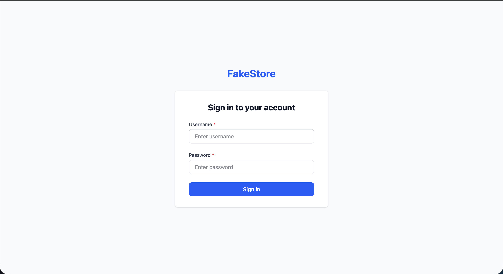

### 4. Shopping Cart

Manajemen keranjang belanja dengan fitur tambah, update quantity, dan hapus item. Proses checkout dengan konfirmasi.

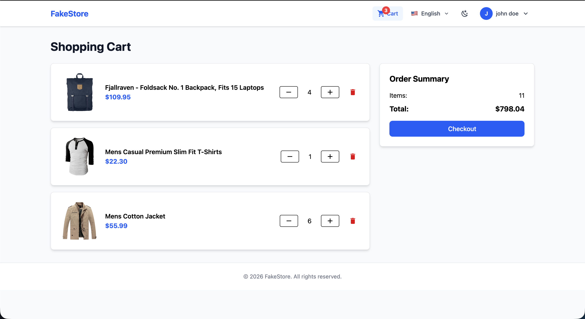

### 5. User Profile

Halaman profil pengguna menampilkan informasi personal dan data akun.

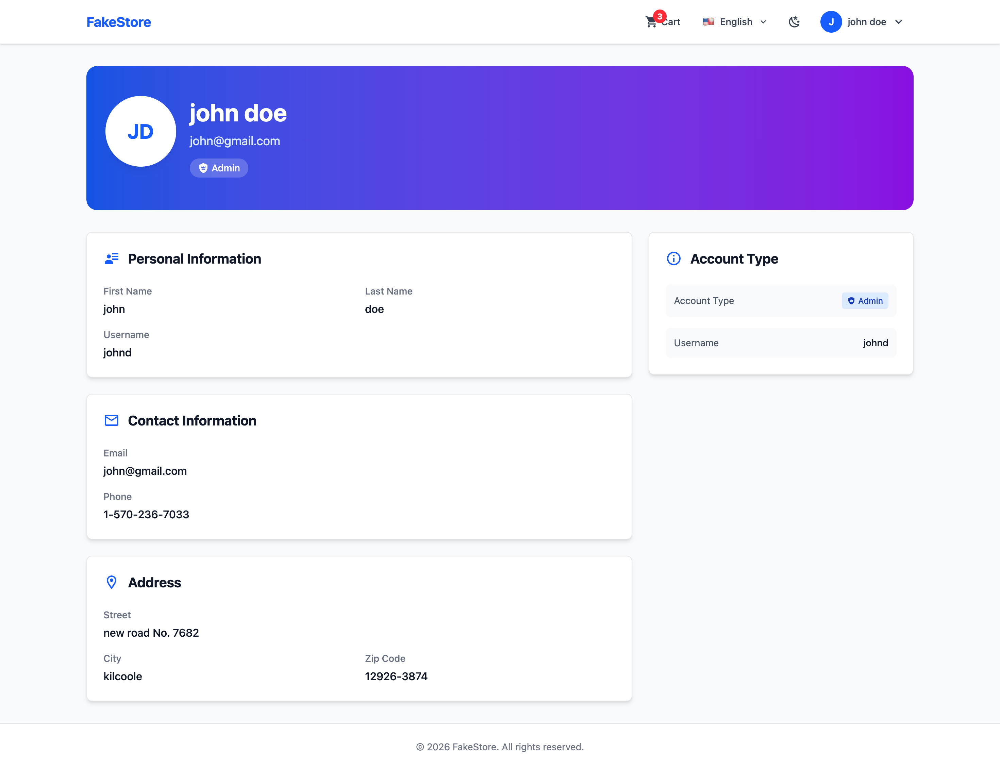

### 6. Admin Dashboard

Dashboard admin menampilkan statistik produk dan pengguna dengan visualisasi yang jelas.

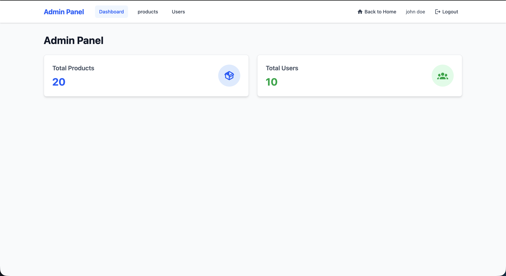

### 7. Admin Products Management

CRUD lengkap untuk manajemen produk dengan form modal yang user-friendly.

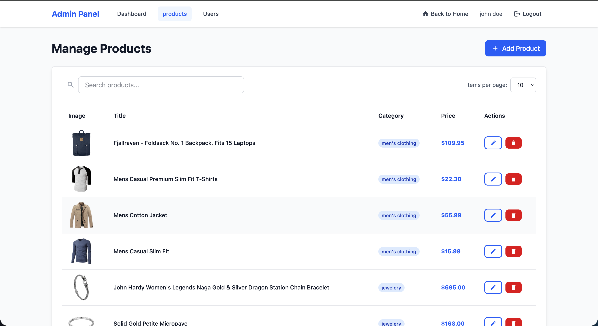
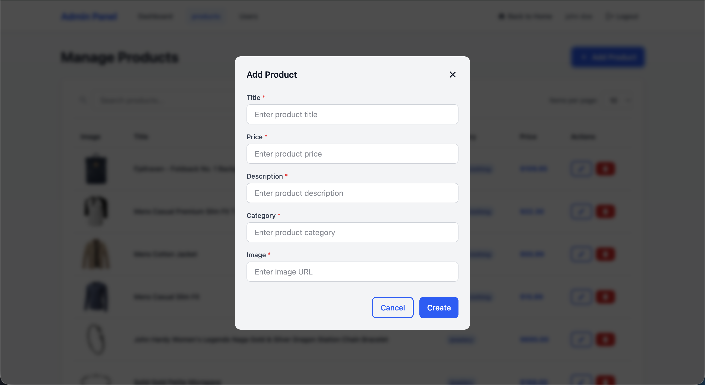
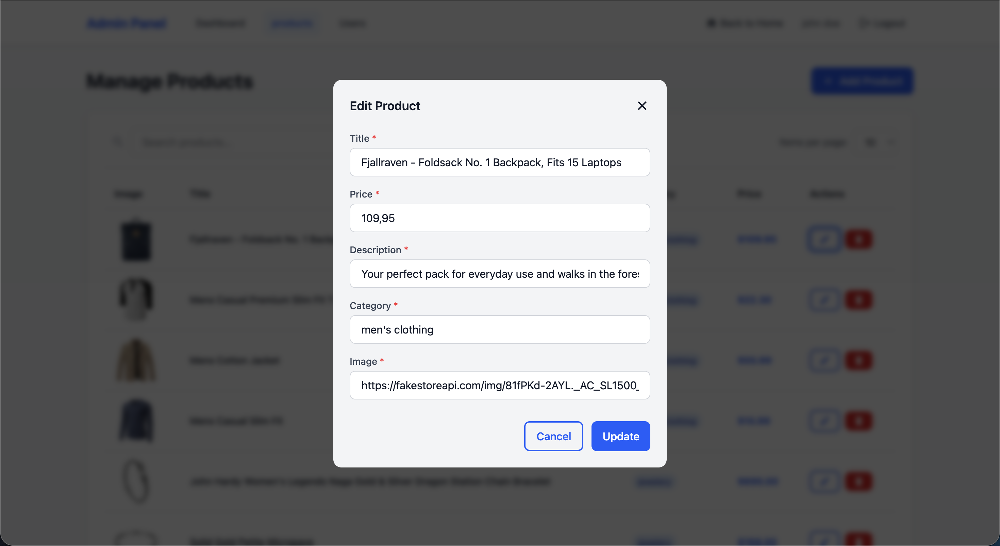

### 8. Admin Users Management

Manajemen pengguna dengan fitur create, update, dan delete user.

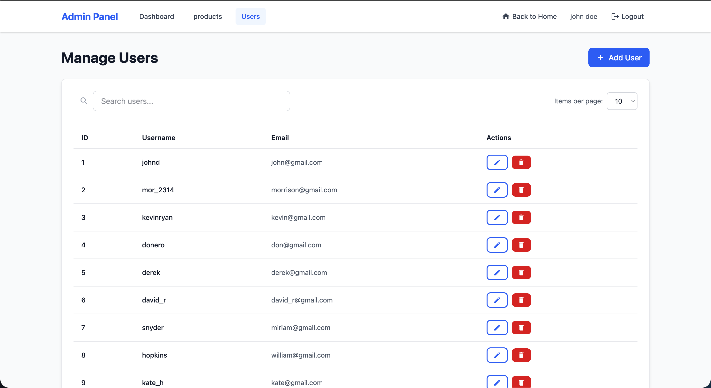
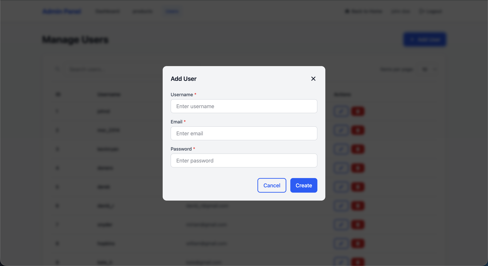

## 📊 Testing Coverage

### Unit Tests (Vitest)

Semua komponen dan views telah diuji dengan coverage 100%. Test cases mencakup:

- Authentication flows
- Product management (CRUD)
- Cart operations (Create, Read, Update, Delete)
- User interactions
- API error handling

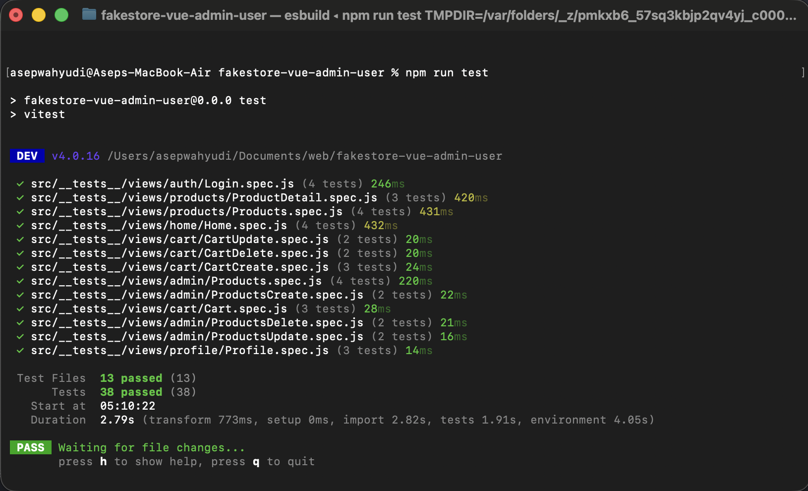

### E2E Tests (Cypress)

End-to-end testing untuk memastikan seluruh flow aplikasi berjalan dengan baik:

- Authentication flows
- Product browsing and cart management
- Admin operations
- User interactions


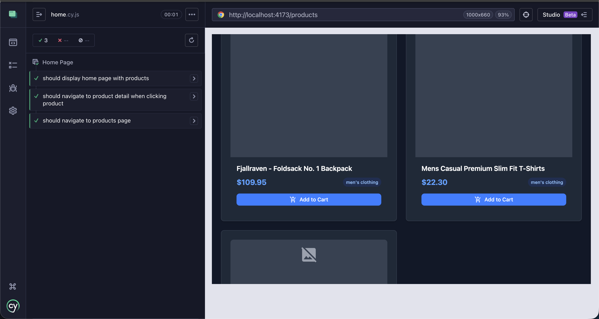
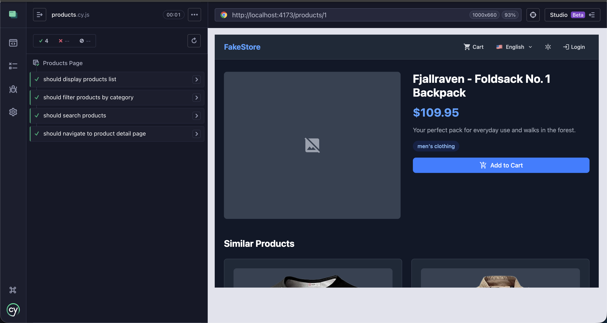
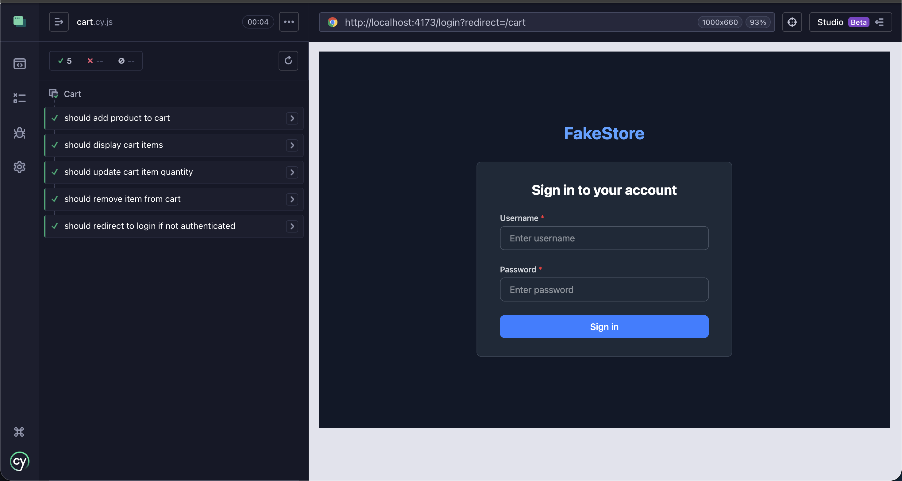
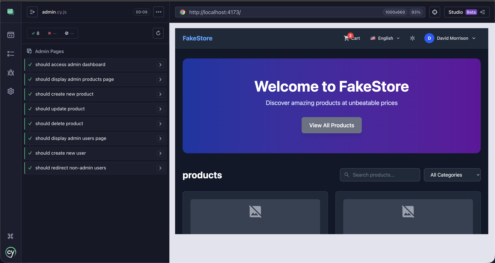

## 🔍 SEO & Performance

Aplikasi dioptimalkan untuk SEO dan performa dengan:

- Meta tags dinamis untuk setiap halaman
- Sitemap.xml untuk search engine indexing
- Robots.txt untuk crawler management
- Lazy loading untuk images
- Code splitting untuk optimal bundle size

### Lighthouse Score

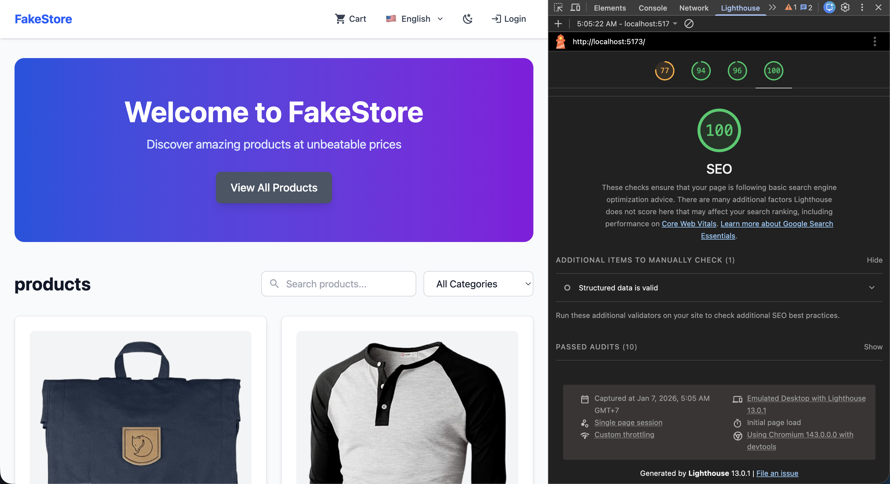

## 🛠️ Project Setup

### Prerequisites

- Node.js 18+
- npm atau yarn

### Installation

```sh
npm install
```

### Development

```sh
npm run dev
```

Aplikasi akan berjalan di `http://localhost:5173`

### Build for Production

```sh
npm run build
```

### Run Unit Tests

```sh
npm run test
```

### Run E2E Tests

Development mode (faster):

```sh
npm run cy:dev
```

Production mode (recommended for CI):

```sh
npm run build
npm run cy
```

### Linting

```sh
npm run lint
```

## 📁 Project Structure

```
src/
├── components/       # Reusable components
│   ├── admin/       # Admin-specific components
│   ├── base/        # Base UI components
│   ├── products/    # Product-related components
│   └── ui/          # UI components (Toast, Confirm, etc)
├── composables/     # Vue composables
├── constants/       # Application constants
├── layouts/         # Layout components
├── plugins/         # Vue plugins (Axios, Vuelidate)
├── router/          # Vue Router configuration
├── services/        # API services
├── stores/          # Pinia stores
├── styles/          # Global styles
├── views/           # Page components
├── __tests__/       # Unit tests
│   ├── mocks/      # Mock data
│   ├── utils/      # Test utilities
│   └── views/      # View tests organized by feature
└── utils/           # Utility functions
```

## 🔐 Authentication

Aplikasi menggunakan JWT token untuk autentikasi. Token disimpan di localStorage dan dikirim dalam header setiap request API.

**Test Credentials:**

- Admin: `johnd` / `m38rmF$`
- User: `mor_2314` / `83r5^_`

## 🌐 Internationalization

Aplikasi mendukung multi-bahasa (English & Indonesian) dengan sistem i18n yang terintegrasi.

## 📝 API Integration

Aplikasi menggunakan [FakeStore API](https://fakestoreapi.com/) untuk data produk, user, dan cart.

## 🎨 Features

- ✅ Dark mode support
- ✅ Responsive design (Mobile, Tablet, Desktop)
- ✅ Form validation
- ✅ Toast notifications
- ✅ Loading states
- ✅ Error handling
- ✅ SEO optimization
- ✅ Accessibility features

## 📄 License

MIT
